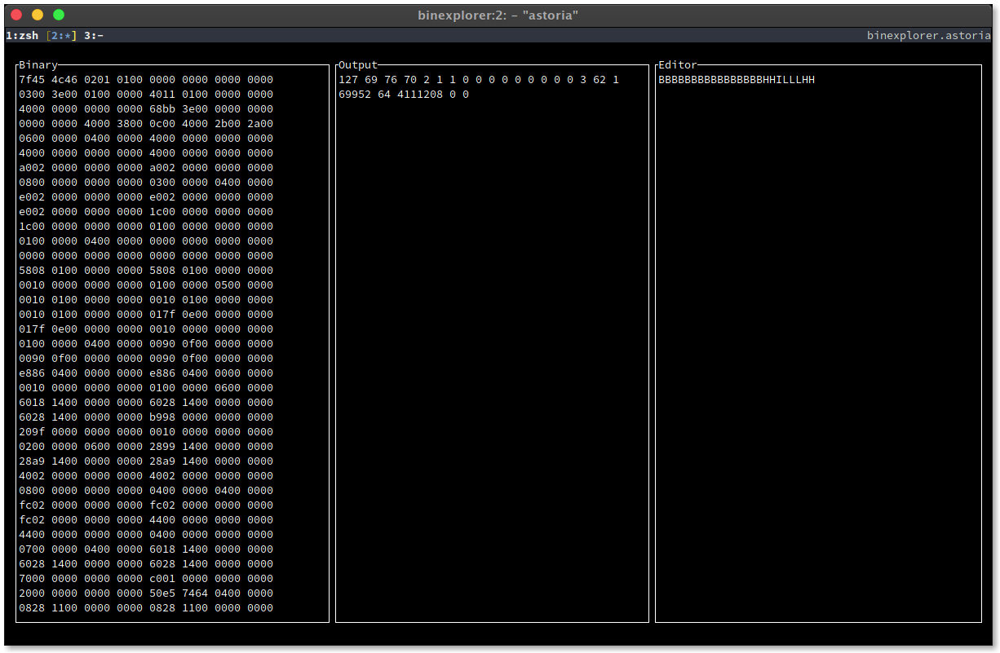

# Binexplorer

For exploring (and attempting to parse) binary files

Shown are three panes:

1. the left pane shows the raw bytes (in hex)
2. the center pane shows the parsed output
3. the right pane is the editor allowing input commands

The input commands are based around the [format characters used by Python's
`struct` package][struct-docs].

[struct-docs]: https://docs.python.org/3.8/library/struct.html#format-characters
